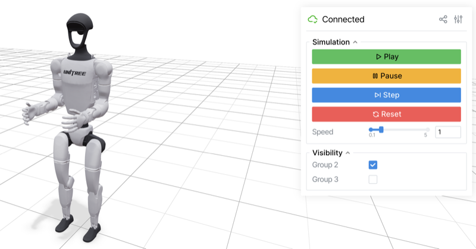

# mj_viser

Web-based MuJoCo viewer built on [Viser](https://github.com/nerfstudio-project/viser). Interactive simulation in the browser with extensible GUI panels for robotics applications.

<p align="center">
  
</p>

## Features

- **Interactive simulation** — play, pause, step, reset, and speed control from the browser
- **All primitive geom types** — box, sphere, cylinder, capsule, ellipsoid, and mesh
- **Two API modes** — built-in simulation loop or user-controlled sync
- **Extensible panels** — add custom GUI panels for sensors, cameras, controls, etc.
- **Multi-client** — multiple browser tabs viewing the same simulation
- **Beautiful rendering** — three-point lighting, proper materials, transparency support

## Installation

```bash
git clone https://github.com/siddhss5/mj_viser.git
cd mj_viser
pip install -e .
```

## Quick Start

### Built-in simulation loop

```python
import mujoco
from mj_viser import MujocoViewer

model = mujoco.MjModel.from_xml_path("robot.xml")
data = mujoco.MjData(model)

viewer = MujocoViewer(model, data)
viewer.launch()  # Opens browser at http://localhost:8080
```

### User-controlled loop

```python
import mujoco
from mj_viser import MujocoViewer

model = mujoco.MjModel.from_xml_path("robot.xml")
data = mujoco.MjData(model)

viewer = MujocoViewer(model, data)
viewer.launch_passive()

while viewer.is_running():
    data.ctrl[:] = my_controller(data)
    mujoco.mj_step(model, data)
    viewer.sync()
```

### Custom panels

```python
import viser
from mj_viser import MujocoViewer, PanelBase

class SensorPanel(PanelBase):
    def name(self) -> str:
        return "Sensors"

    def setup(self, gui: viser.GuiApi, viewer: MujocoViewer) -> None:
        with gui.add_folder(self.name()):
            self._readout = gui.add_text("Force", initial_value="", disabled=True)

    def on_sync(self, viewer: MujocoViewer) -> None:
        self._readout.value = f"{viewer.data.sensordata[0:3]}"

viewer = MujocoViewer(model, data)
viewer.add_panel(SensorPanel())
viewer.launch()
```

## Examples

```bash
# Clone MuJoCo Menagerie for robot models
git clone https://github.com/google-deepmind/mujoco_menagerie.git

# Interactive viewer
uv run python examples/basic_launch.py mujoco_menagerie/universal_robots_ur5e/scene.xml

# User-controlled loop
uv run python examples/sync_mode.py mujoco_menagerie/franka_emika_panda/scene.xml

# Custom panel demo
uv run python examples/custom_panel.py mujoco_menagerie/unitree_g1/scene.xml
```

## Development

```bash
git clone https://github.com/siddhss5/mj_viser.git
cd mj_viser
uv sync --all-extras
uv run pytest
uv run ruff check src/ tests/
```

## License

MIT
